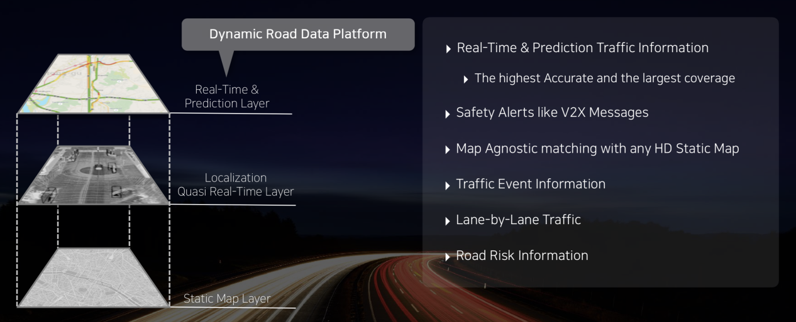
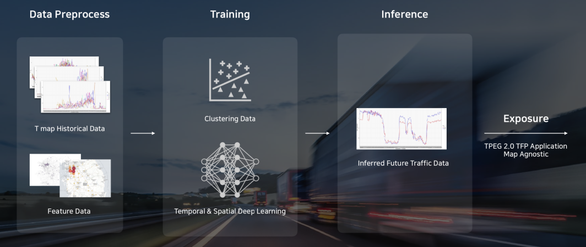
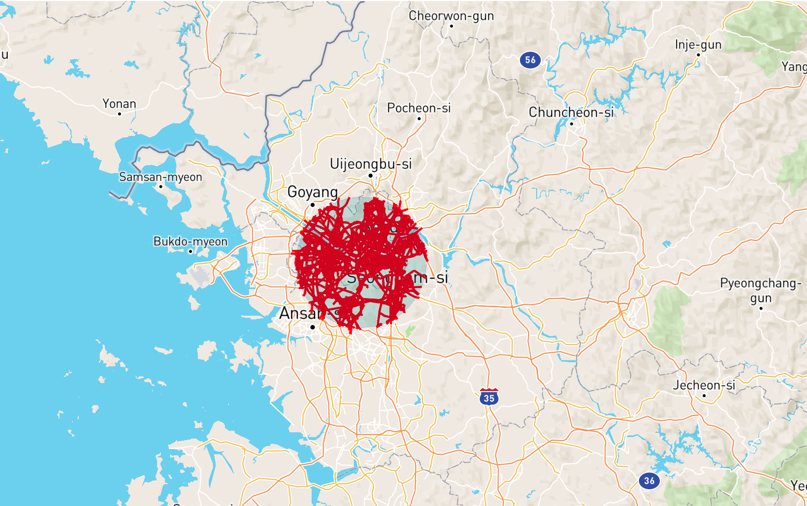
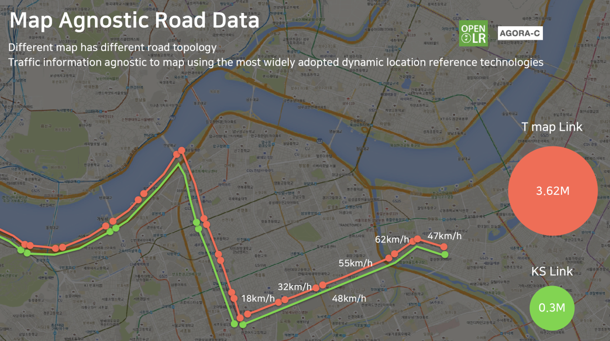
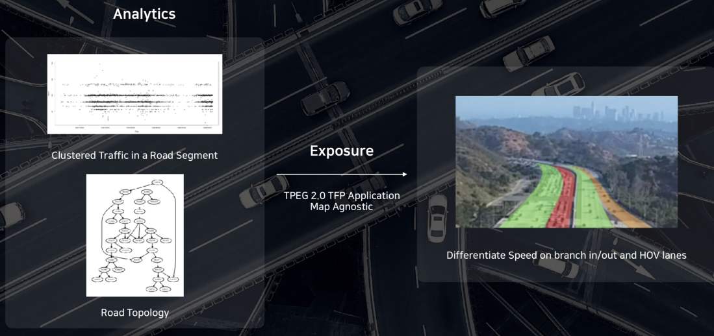

주요 기능
=======================================
RUUT 는 SKT 모빌리티 서비스 및 플랫폼의 데이터를 표준 및 규격화 된 형태로 제공합니다. 본 페이지에서는 RUUT 가 제공하는 데이터의 종류와 더불어 데이터 제공에 필요한 기반 기술 및 기능을 서술합니다. 전체적인 제공 기능의 추상적인 형상은 아래 이미지를 참조 하시기 바랍니다. RUUT 의 주요 기능은 다음과 같습니다.

* 실시간 및 예측 교통 정보 제공
* RUUT 고유 API 와 TPEG2 메시지 응답
* 도로 위험도 및 운전자 평가 점수 제공
* V2X 서비스 Enabling
* 지도 비 의존적인 위치 참조 규격 제공
* 차선 단위 교통 정보 제공 (일부)

실시간 및 예측 교통 정보 제공
--------------------------
SKT T Map 과 연동하여 1800만 운전자의 이동 정보 데이터를 바탕으로 실시간 교통 정보와 함께, 해당 데이터를 기반으로 머신 러닝을 통해 분석한 교통 예측 정보를 제공합니다.

실시간 교통 정보 (RTTI)
''''''''''''''''''''''''''
실시간 교통 정보는 도로 상태 정보 및 이벤트 정보로 이루어져 있습니다. 각각의 도로 세그먼트에 대해서 국내 최대의 검증 데이터를 기반으로 실시간의 세그먼트 주행 속도, 평균 이동 시간, 속도 제한 값, 사고 정보, 공사 정보, 행사 정보(일정) 등을 제공함으로써 고품질의 모빌리티 서비스 개발에 활용할 수 있습니다.

예측 교통 정보 (FTI)
''''''''''''''''''''''''''
T Map 의 방대한 데이터를 기반으로 현재 시간 기준 1시간 이후의 미래 시점에 대한 예측 교통 정보를 제공합니다. 예측 교통 정보는 머신 러닝 기반으로 학습된 데이터를 토대로 명시된 시간에서 도로 세그먼트의 차량 예상 주행 속도를 제공합니다. 

Geospatial Query
''''''''''''''''''''''''''
교통 정보 검색의 효율성을 극대화 시키기 위하여 5개의 지리적 필터를 제공합니다. 해당 필터를 활용하여 필요한 위치 및 영역의 교통 정보만 선택적으로 요청할 수 있으며, 다양한 형태를 제공하기 때문에 개발 용이성을 확보할 수 있습니다.

제공하는 필터 타입은 아래와 같으며 상세 사용법은 :ref:`GeoFilter 상세 <geofilter>` 를 참조 하시기 바랍니다.

* 원형 (중심 및 반지름 활용)
* 박스형 (가로 및 세로 길이 활용)
* 중심점 기반 박스형 (중심 및 가로, 세로 길이 활용)
* 스팟형 (기점 기반 가장 가까운 세그먼트 정보 제공)
* 지역형 (행정 구역 기반)

RUUT API 응답 및 TPEG2 메시지 제공
--------------------------
도로 세그먼트에 대한 정보 요청에 대하여 2가지 응답 규격을 제공합니다. RUUT API 는 JSON 형태의 상세 교통 정보를 SKT 독자 규격에 따라 응답합니다. TEPG2 메시지는 ISO 표준에 따라 TFP/TEC/WEA 3가지 어플리케이션 메시지를 제공합니다. 각 응답 규격의 상세 정보는 :ref:`RUUT 응답규격 <segment_formats>` 과 :ref:`TPEG2 메시지 상세 <tpeg2_formats>` 을 참조하시기 바랍니다.

RNA (Road Network Analysis, 서비스 예정)
--------------------------
도로를 구성하는 객체에 따른 스코어링을 통해 안전한 운행 환경을 조성할 수 있도록 RNA, 도로 네트워크 분석 정보를 제공합니다. RNA 는 아래 항목에 대한 스코어링으로 구성되어 있습니다.

* 도로 링크 위험도 스코어링 - 도로 세그먼트의 위험요소를 분석하여 수치화 합니다.
* 운전자 운행 습관 스코어링 - 일반적인 운전자 행태 안전도를 분석하여 수치화 합니다.

V2X 서비스
--------------------------
T Map 을 통해 서비스 되고 있는 응급차량 접근 알림, 전방 급정거 알림 등의 SKT V2X 서비스를 도메인 무관하게 활용하실 수 있도록 V2X 서비스를 제공합니다. 간단한 API 호출을 통하여 능동적으로 T Map 에 제공되고 있는 것과 동일한 V2X 원시 데이터를 제공받을 수 있습니다. V2X 서비스의 세부 사용 방법은 :ref:`V2X API 호출규격 <v2x_apidoc>` 을 참고하시기 바랍니다. 

Map Agnostic Location Referencing
--------------------------
교통 정보 서비스를 제공 하기 위해서는 도로의 어느 영역 데이터 인지를 확인할 수 있어야 합니다.

openLR
''''''''''''''''''''''''''
OpenLR 은 TOMTOM 에서 개발한 open standard 의 지도 형태에 독립적인 위치 참조 규격 입니다. 원본 맵 제공자는 OpenLR 표준 규격에 따라서 원본 맵을 인코딩 하게 됩니다. 이렇게 인코딩 된 결과는 맵 형태에 무관하게 openLR 표준 규격으로 디코딩하여 활용할 수 있습니다. RUUT 의 다양한 실시간 교통 정보는 T map 의 고유 맵 규격을 기반으로 생성 및 가공되나 해당 정보의 최종 소비자가 사용하는 맵의 형태에 따라 openLR 디코딩을 통하여 손쉽게 적용할 수 있습니다. RUUT의 교통 정보는 노드-링크 형태의 위치 참조 방식 위에서 구현되므로 openLR 인코딩 규격 중 line 방식 인코딩을 지원합니다. OpenLR 은 간결함과 확장성을 바탕으로 다양한 모빌리티 관련 기업이 지원하고 있습니다. OpenLR 의 컨셉 및 디코딩 방식에 대해서는 openLR 공식 문서를 참조하시기 바랍니다.

AGORA-C
''''''''''''''''''''''''''
AGORA-C 는 ISO 국제 표준 위치 참조 규격 입니다.

차선 단위 교통 정보 제공
--------------------------
RUUT 는 도로 특정 영역에 대하여 차선 단위 교통 정보를 제공합니다.

