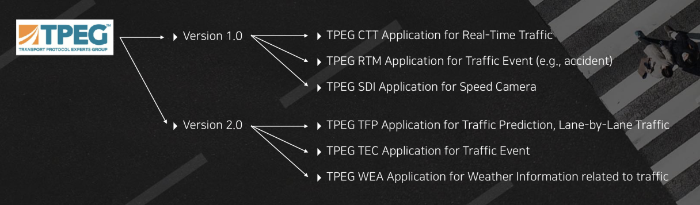

주요 기능
=======================================
RUUT 는 SKT의 모빌리티 연관 서비스들의 데이터를 수집하여 아래와 같은 기능을 제공 합니다

.. image:: ../images/function/ruut_concepts.png

교통 정보 제공
--------------------------
SKT T Map 과 연동하여 1800만 운전자의 실시간 운전정보 데이터를 제공 합니다. 실시간 교통 정보 데이터는 RUUT 전용 포맷 (JSON) 및 TPEG2 (Base64 Encoded XML, TPEG ML) 형태로 제공 되며 고객 리소스 최적화를 위하여 다양한 옵션 파라미터 조합을 제공합니다.

다양한 Geospatial Query
''''''''''''''''''''''''''
교통 정보 검색을 위하여 지리적 위치 범위에 대한 필터링을 제공합니다. 사용자는 필요한 지리적 영역의 형태 및 크기를 직접 입력하여 데이터 크기를 최적화하여 검색할 수 있습니다. 실제 자동차 네비게이션 산업에서 활용되고 있는 지리적 영역 필터링 형태 외에도 사용자 취향에 따른 필터 옵션을 제공하고 있습니다. 

.. image:: ../images/function/geoquery.png

RUUT API 제공
''''''''''''''''''''''''''
RUUT 실시간 교통 정보는 JSON 포맷 형태로 제공 됩니다. 상세 포맷은 :ref:`RUUT포맷 <apidoc>` 을 참조 하세요. 사용자는 표준화된 RESTful API 호출을 통하여 RUUT 실시간 교통 정보를 획득할 수 있습니다. 

TPEG2 메시지 제공
''''''''''''''''''''''''''
최신의 교통 정보 전달 표준인 TPEG2 메시지를 제공합니다. TPEG2 에 대해서는 ISO 표준 사이트를 참조 하세요. RUUT 는 TPEG2 어플리케이션 중 TFP (실시간 교통 정보), TEC (실시간 사고 및 이벤트 정보), WEA (실시간 날씨 정보) 를 제공합니다.

예측 교통 정보 (FTI)
''''''''''''''''''''''''''
RUUT 는 다양한 교통 데이터를 통합 분석한 결과를 토대로 현재 시점부터 1시간 내의 교통 예측 정보를 제공합니다. 교통 예측 정보는 실시간 교통 정보 형태로 제공되며 정보의 제공 시간이 현재가 아닌 미래 시간으로 작성 됩니다. 

.. image:: ../images/function/ruut_prediction.png

V2X 서비스
--------------------------
T Map 을 통해 서비스 되고 있는 응급차량 접근 알림, 전방 급정거 알림 등의 SKT V2X 서비스를 T Map 이 아닌 경우에도 활용할 수 있도록 V2X 푸쉬 서비스를 제공합니다. Web hook 을 통해 연동된 엔터티 간 메시지 푸쉬를 통해 SKT V2X 서비스를 활용하실 수 있습니다.

Map Agnostic Location Referencing
--------------------------
교통 정보 서비스를 제공 하기 위해서는 도로의 어느 영역 데이터 인지를 확인할 수 있어야 합니다.

.. image:: ../images/function/lr.png

openLR
''''''''''''''''''''''''''
OpenLR 은 TOMTOM 에서 개발한 open standard 의 지도 형태에 독립적인 위치 참조 규격 입니다. 원본 맵 제공자는 OpenLR 표준 규격에 따라서 원본 맵을 인코딩 하게 됩니다. 이렇게 인코딩 된 결과는 맵 형태에 무관하게 openLR 표준 규격으로 디코딩하여 활용할 수 있습니다. RUUT 의 다양한 실시간 교통 정보는 T map 의 고유 맵 규격을 기반으로 생성 및 가공되나 해당 정보의 최종 소비자가 사용하는 맵의 형태에 따라 openLR 디코딩을 통하여 손쉽게 적용할 수 있습니다. RUUT의 교통 정보는 노드-링크 형태의 위치 참조 방식 위에서 구현되므로 openLR 인코딩 규격 중 line 방식 인코딩을 지원합니다. OpenLR 은 간결함과 확장성을 바탕으로 다양한 모빌리티 관련 기업이 지원하고 있습니다. OpenLR 의 컨셉 및 디코딩 방식에 대해서는 openLR 공식 문서를 참조하시기 바랍니다.

AGORA-C
''''''''''''''''''''''''''
AGORA-C 는 ISO 국제 표준 위치 참조 규격 입니다.

차선 단위 교통 정보 제공
--------------------------
RUUT 는 도로 특정 영역에 대하여 차선 단위 교통 정보를 제공합니다.

.. image:: ../images/function/lane.png