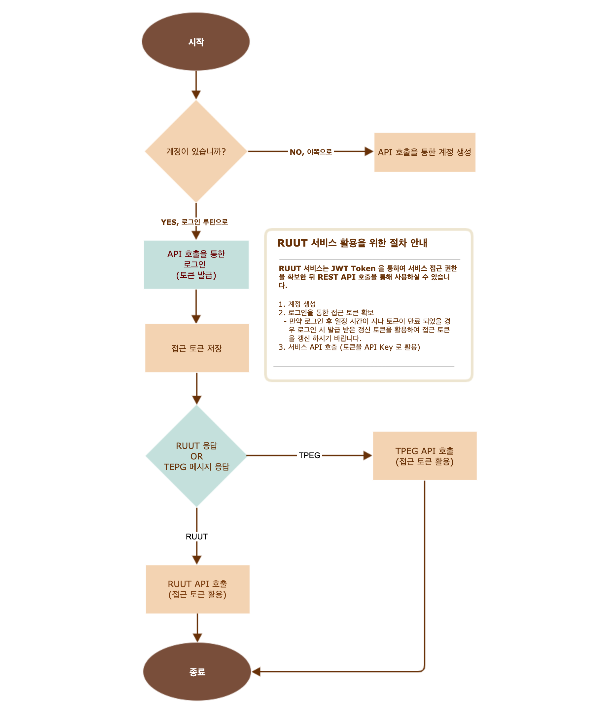

RUUT 서비스 가이드
=======================================
RUUT 의 모든 서비스는 REST API 호출 기반으로 이루어져 있습니다. 전체적인 서비스 사용 절차는 아래 그림과 같습니다.

.. _general_authentication:

인증 (공통 프로세스)
--------------------------
계정 생성
''''''''''''''''''''''''''
API 호출을 통해 로그인을 수행하고 접근 권한을 담은 token 을 부여 받습니다.

.. rst-class:: table-width-fix
.. rst-class:: text-align-justify

============= =====================================
   **POST**   `/api/auth/v1/join`
============= =====================================
 
- Header

.. rst-class:: table-width-fix
.. rst-class:: table-width-full
.. rst-class:: text-align-justify

+--------------+--------+------------------+--------------+
| option       | Type   | Default          | Description  |
+==============+========+==================+==============+
| Content-Type | string | application/json | content type |
+--------------+--------+------------------+--------------+

- Body

.. rst-class:: table-width-fix
.. rst-class:: table-width-full
.. rst-class:: text-align-justify

==========  ========  ========================
Key         Type      Description
==========  ========  ========================
username    String    사용자 ID
----------  --------  ------------------------
password    String    패스워드
----------  --------  ------------------------
email       String    사용자 이메일 주소
----------  --------  ------------------------
phone       String    휴대폰 번호 (01x-xxxx-xxxx)
==========  ========  ========================

.. role:: underline
        :class: underline

- Example Code

:underline:`Request`

.. code-block:: none

    content-type:"application/json"

    {
        "username":"example",
        "password":"1234",
        "email":"example@mail.com",
        "phone":"010-0000-0000"
    }

:underline:`Response (code: 200)`

* 별도 응답 body 없음

.. rst-class:: text-align-justify

로그인 (인증 토큰 획득)
''''''''''''''''''''''''''
API 호출을 통해 계정을 생성 합니다.

.. rst-class:: table-width-fix
.. rst-class:: text-align-justify

============= =====================================
   **POST**   `/api/auth/v1/login`
============= =====================================

- Header

.. rst-class:: table-width-fix
.. rst-class:: table-width-full
.. rst-class:: text-align-justify

+--------------+--------+------------------+--------------+
| option       | Type   | Default          | Description  |
+==============+========+==================+==============+
| Content-Type | string | application/json | content type |
+--------------+--------+------------------+--------------+

- Body

.. rst-class:: table-width-fix
.. rst-class:: table-width-full
.. rst-class:: text-align-justify

==========  ========  ========================
Key         Type      Description
==========  ========  ========================
username    String    사용자 ID
----------  --------  ------------------------
password    String    패스워드
==========  ========  ========================

.. role:: underline
        :class: underline

- Example Code

:underline:`Request`

.. code-block:: none

    content-type:"application/json"

    {
        "username":"example",
        "password":"1234",
    }

:underline:`Response (code: 200)`

.. code-block:: json

    {
        "token":"eyJhbGciOiJIUzUxMiJ9.eyJzdWIiOiJzeXNhZG1pbkB0aG…",
        "refreshToken": "eyJhbGciOiJIUzUxMiJ9.eyJzdWIiOiJzeXNhZG1…"
    }

토큰 갱신
''''''''''''''''''''''''''
API 호출을 통해 만료된 인증 토큰을 갱신 합니다.

.. rst-class:: table-width-fix
.. rst-class:: text-align-justify

============= =====================================
   **POST**   `/api/auth/v1/token`
============= =====================================

- Header

.. rst-class:: table-width-fix
.. rst-class:: table-width-full
.. rst-class:: text-align-justify

+--------------+--------+------------------+--------------+
| option       | Type   | Default          | Description  |
+==============+========+==================+==============+
| Content-Type | string | application/json | content type |
+--------------+--------+------------------+--------------+

- Body

.. rst-class:: table-width-fix
.. rst-class:: table-width-full
.. rst-class:: text-align-justify

=============  ========  ========================
Key            Type      Description
=============  ========  ========================
refreshToken   String    갱신 토큰 정보
=============  ========  ========================

.. role:: underline
        :class: underline

- Example Code

:underline:`Request`

.. code-block:: none

    content-type:"application/json"

    {
        "refreshToken": "eyJhbGciOiJIUzUxMiJ9.eyJzdWIiOiJzeXNhZG1…"
    }

:underline:`Response (code: 200)`

.. code-block:: json

    {
        "token":"eyJhbGciOiJIUzUxMiJ9.eyJzdWIiOiJzeXNhZG1pbkB0aG…",
        "refreshToken": "yJ0eXAiOiJKV1QiLCJhbGciOiJIUzUxMiJ9.eyJdWIiO…"
    }

패스워드 변경
''''''''''''''''''''''''''
API 호출을 통해 패스워드를 변경 합니다.

.. rst-class:: table-width-fix
.. rst-class:: text-align-justify

============= =====================================
   **POST**   `/api/auth/v1/changePassword`
============= =====================================

- Header

.. rst-class:: table-width-fix
.. rst-class:: table-width-full
.. rst-class:: text-align-justify

+--------------+--------+------------------+--------------+
| option       | Type   | Default          | Description  |
+==============+========+==================+==============+
| Content-Type | string | application/json | content type |
+--------------+--------+------------------+--------------+

- Body

.. rst-class:: table-width-fix
.. rst-class:: table-width-full
.. rst-class:: text-align-justify

=============  ========  ========================
Key            Type      Description
=============  ========  ========================
password       String    기존 패스워드
-------------  --------  ------------------------
newPasswrod    String    변경할 패스워드
=============  ========  ========================

.. role:: underline
        :class: underline

- Example Code

:underline:`Request`

.. code-block:: none

    content-type:"application/json"

     {
        "passwrod":"1234",
        "newPassword":"5678",
    }

:underline:`Response (code: 200)`

* 별도 응답 body 없음

패스워드 리셋 (이메일 연동)
''''''''''''''''''''''''''
API 호출을 통해 패스워드를 변경 합니다.

.. rst-class:: table-width-fix
.. rst-class:: text-align-justify

============= =====================================
   **POST**   `/api/auth/v1/resetPasswordByEmail`
============= =====================================

- Header

.. rst-class:: table-width-fix
.. rst-class:: table-width-full
.. rst-class:: text-align-justify

+--------------+--------+------------------+--------------+
| option       | Type   | Default          | Description  |
+==============+========+==================+==============+
| Content-Type | string | application/json | content type |
+--------------+--------+------------------+--------------+

- Body

.. rst-class:: table-width-fix
.. rst-class:: table-width-full
.. rst-class:: text-align-justify

=============  ========  ========================
Key            Type      Description
=============  ========  ========================
email          String    회원 정보에 등록된 메일 주소
=============  ========  ========================

.. role:: underline
        :class: underline

- Example Code

:underline:`Request`

.. code-block:: none

    content-type:"application/json"

    {
        "email":"example@mail.com"
    }

:underline:`Response (code: 200)`

.. code-block:: none

    {
        "password": "WEx8Ekp1rT"
    }

RUUT 고유 API 활용
--------------------------

RUUT 고유 API 는 JSON 형태로 실시간 교통 정보, 예측 교통 정보, 돌발(사고 및 이벤트) 정보, V2X 서비스 구독 등의 기능을 제공하고 있습니다. 앞서 인증 과정에서 발급받은 API 접근 키 API 헤더에 포함 시킨 후 
:ref:`API규격 <apidoc>`에 따라 원하는 정보를 요청 하시면 됩니다. 

- Header

.. rst-class:: table-width-fix
.. rst-class:: table-width-full
.. rst-class:: text-align-justify

+---------------------+--------+------------------+--------------+
| option              | Type   | Default          | Description  |
+=====================+========+==================+==============+
| Content-Type        | string | application/json | content type |
+---------------------+--------+------------------+--------------+
| X-Authorization     | string | {accessToken}    | API Key      |
+---------------------+--------+------------------+--------------+

실시간 교통 정보
''''''''''''''''''''''''''

실시간 교통 정보를 획득 하려면 API URL 에 하기 항목을 명시하셔야 합니다. 

:underline:`예) 특정 지역 중심 반경 1km 원형 영역 내 모든 실시간 교통 정보를 openLR 위치 참조 형태로 요청`

* :ref:`Geo filtering <geofilter>` 교통 정보 탐색하고자 하는 지리적 영역 규정 (`geoFilter`)
* 획득 하고자 하는 정보의 유형 및 카테고리 선택 (`rttiField`, `lane`)
* 위치 참조 방식 선택 (`lr`)

.. _segment_example:

:underline:`Request Example`

.. code-block:: none

  // 원형 geo filter 반경 1km, 모든 교통 정보 표출, 위치 참조 openLr
  ruut/v1/segments?geoFilter=circle&center=37.397619,127.112465&radius=1&incidentField=all
  &lr=openLr

:underline:`Response Example`

.. code-block:: none

  {
    "segments": [
        {
            "segmentId": "1020245101",
            "roadCategory": "1",
            "speed": "27",
            "limit": "70",
            "freeFlow": "70",
            "travelTime": "43",
            "openLr": "C1pllBqXeQ4wBf/X/tQOEQ==",
            "linkId": "10202451",
            "segmentCoordinates": {
                "point1": {
                    "lat": "37.394568",
                    "lon": "127.120485"
                },
                "point2": {
                    "lat": "37.391561",
                    "lon": "127.120067"
                }
            },
            "timeStamp": "2020-03-03 13:19:00"
        },
        ...

돌발 정보 (이벤트, 사고)
''''''''''''''''''''''''''

돌발 정보를 획득 하려면 API URL 에 하기 항목을 명시하셔야 합니다. 

:underline:`예) 특정 지역 중심 반경 1km 원형 영역 내 모든 돌발 정보를 openLR 위치 참조 형태로 요청`

* :ref:`Geo filtering <geofilter>` 돌발 정보 탐색하고자 하는 지리적 영역 규정 (`geoFilter`)
* 획득 하고자 하는 정보의 유형 및 카테고리 선택 (`incidentField`, `type`)
* 위치 참조 방식 선택 (`lr`)

.. _incident_example:

:underline:`Request Example`

.. code-block:: none

  ruut/v1/incidents?geoFilter=circle&center=37.397619,127.112465&radius=1
  &incidentField=all&type=all&lr=all

:underline:`Response Example`

.. code-block:: none

  {
    "incidents": [
        {
            "segmentId": "209699101",
            "incidentId": "L93105264991",
            "incidentType": "B",
            "lane": "00",
            "length": 83,
            "vehicleKind": "000000",
            "description": "<경찰청제공>[공사] 세계로 삼평중삼거리 에서 사송사거리 방향 1차로 도로공사 주의운전",
            "schedule": {
                "isPlanned": "",
                "startTime": "202003030806",
                "endTime": "202003031800",
                "reoccuring": {
                    "daysOfWeek": "",
                    "from": "",
                    "until": ""
                }
            },
            "openLr": "C1pk5xqYcSugCP/FAb0rHA==",
            "linkId": "2096991",
            "segmentCoordinates": {
                "point1": {
                    "lat": "37.399888",
                    "lon": "127.116777"
                },
                "point2": {
                    "lat": "37.404339",
                    "lon": "127.11618"
                }
            },
            "timeStamp": "2020-03-03 13:15:00"
        },
        ...

V2X 서비스 연동 요청 
--------------------------

Webhook URL 등록 작업
''''''''''''''''''''''''''

예측 교통 정보를 획득 하려면 원하는 V2X 서비스의 유형과 webhook 이 인입될 URL을 입력하여야 합니다.

:underline:`예) 응급 차량 출동 알림 V2X 서비스를 https://myserverurl.net 에서 수신하기를 요청`

* Header 에 사용자 인증 정보 포함
* Webhook 연동할 서비스명 설정
* Webhook 인입될 URL 명시 (unreachable 상태가 지속될 경우 무통보 삭제합니다)

:underline:`Request Example`

.. code-block:: json

   POST root/v1/hooks
   header : X-Authorization
   
   Body : 
   {
     "url":"https://myserverurl.net",
     "locationReference":"openLR",
     "events": [
       "emergencyVehicle"
     ]
   }

Incoming Webhook
''''''''''''''''''''''''''
세부 정보는 :ref:`V2X 서비스 Incoming Webhook 명세 <v2xincoming>` 을 참고하시기 바랍니다.

도로 위험 점수 획득 
--------------------------
'20년 2분기 제공 예정

예측 교통 정보
''''''''''''''''''''''''''
제공 예정 (일정 미정)

과거 교통 정보 요청
--------------------------

과거 교통 정보 획득을 위해서는 관리자에게 직접 문의 주시기 바랍니다.

